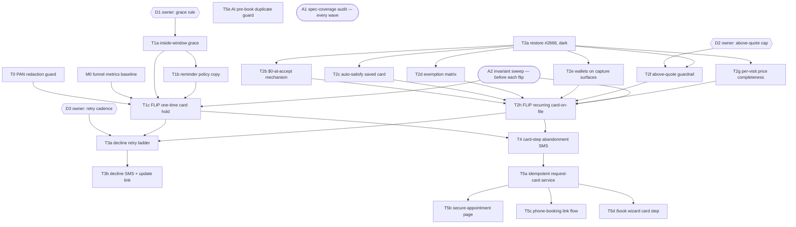

# Card-on-File Booking — Outcome-Contract Task Graph (sketch)

Method sketch, 2026-07-16. This applies an outcome-contract task-graph method to the
owner-approved card-on-file booking build. **Source of truth for scope and decisions
remains `docs/card-on-file-booking-build-spec.md`** — this doc adds no new decisions;
it restructures the spec's phases into verifiable tasks so "done" is checkable by
someone who never read the diff.

## Why structure it this way

Two failure modes this method is designed to close (both observed on a recent
external task-graph agent run, and both plausible on a build this size):

1. **Spec features silently dropped from the graph.** Fixed by a standing
   coverage-audit node (A1) that diffs spec clauses against task contracts at the end
   of every wave — a missing feature becomes a detected condition, not a
   retrospective "prob my fault."
2. **"Functional but wrong on screen."** Unit tests and even a code reviewer pass a
   flow that renders badly or demands a card twice. Fixed by giving every
   customer-surface task a live-browser verification clause (`ui-verify` /
   Playwright), executed by a verifier who does not read the implementation.

## Contract format

Each task = **id · deps · worker deliverable · outcome contract**. The outcome
contract is a list of observable assertions a verifier can check without reading the
diff. A task is done when its contract passes — not when its PR merges.

Every contract implicitly binds the spec §2 invariants (no card data on Waves
servers; waves-billing invariants; v8+ consent; deposit flag stays unset; idempotency
on the durable entity; frozen terms). An invariant violation fails the task
regardless of its own assertions.

Verification tiers:

| Tier | Meaning |
|---|---|
| **V-test** | Automated tests in repo (unit / contract / race) |
| **V-browser** | Live rendered flow, screenshots, real viewport (`ui-verify` skill) |
| **V-data** | Read-only prod/staging queries (`waves-db` discipline) |
| **V-owner** | Adam's judgment — a decision or a flip approval. Never guessed (repo rule 3) |

## The graph

Phase order 4-before-5 follows spec §5 decision 6 (protect the funnel being bought
first). T5e has no hard dependency and can run any time.

## Status (A1 audit, 2026-07-16)

The repo moved between the spec (2026-07-12) and this audit. Verified against main:

- **Done in code:** T0 (`server/utils/pan-scrub.js` + recording quarantine, PR #2676),
  T1a (booking-age grace in `isWithinCancelWindow`), T1b (reminder policy clause),
  T2a–T2g (`recurring-card-on-file.js` restore + exemptions; above-quote cap and
  per-visit completeness via Codex #2680), T3a/T3b (#2738 saved-card retries,
  #2742 decline notice), T4 (#2729 payment-step abandonment, dark).
- **Owner actions outstanding:** T1c (`ONE_TIME_CARD_HOLD` flip), T2h
  (`RECURRING_CARD_ON_FILE` flip), D1–D3 confirmations.
- **Open code:** Wave 5. T5e (AI pre-book duplicate guard widening) and T5a
  (idempotent request-card funnel: `appointment-card-request.js`, dark behind
  `APPOINTMENT_CARD_REQUEST` + the inactive `secure_appointment_card` template)
  implemented 2026-07-16 on this branch. T5b (the `/secure/:token` page the
  link points at) is next — no trigger path is wired into T5a until it exists.
  T5c/T5d not started.

## Nodes and contracts

### Wave 0 — independent, ship first

**T0 — PAN redaction guard** (spec Phase 0)
*Contract:*
- Seeded transcript fixtures with spaced / dashed / spoken-digit Luhn-valid PANs
  persist to `call_log` masked to last4. (V-test)
- No PAN reaches any LLM prompt path — extraction, corpus miner, KB — asserted on
  assembled prompt text, not on intent. (V-test)
- Luhn-failing digit runs (phone numbers, account numbers) pass through unmasked. (V-test)
- Existing call-pipeline tests green.

**M0 — launch metrics baseline** (spec §4: define *before* the Phase 1 flip)
*Contract:*
- Funnel events emitted and queryable: estimate viewed → slot picked → card step
  started → booked. (V-data)
- Decline-rate, AR-aging, and no-show/fee queries written and returning pre-launch
  baselines. (V-data)

### Wave 1 — one-time card hold goes live

**D1 — owner decision:** inside-window grace rule. Default if unstated:
`min(24h, time-since-booking)`. (V-owner)

**T1a — inside-window booking grace** · deps: D1
*Contract:*
- Boundary table (V-test): booking made 2h pre-slot, cancelled immediately → **no
  fee**; booking made 3 days out, cancelled 20h pre-slot → **fee**; exact boundary
  cases per the D1 rule.
- Frozen-terms invariant: fee/window shown at consent match the hold row even after a
  config change. (V-test)

**T1b — reminder copy states the policy** · deps: T1a
*Contract:*
- Reminders for card-hold bookings carry cutoff + fee amount + a working reschedule
  link; non-card-hold reminders byte-identical to before. (V-test + V-browser on
  rendered SMS preview)

**T1c — flip `ONE_TIME_CARD_HOLD`** · deps: T0, M0, T1a, T1b, A2 · (V-owner to pull
the trigger)
*Contract:*
- Runbook §4 six-step smoke test passes on an owner-controlled estimate. (V-browser)
- Week-one monitoring queries return sane values. (V-data)
- Rollback lever re-verified against the runbook.

### Wave 2 — recurring card-on-file at accept

**T2a — restore #2668 behind dark flag** (revert the #2671 revert, per spec Phase 2)
*Contract:* restored test suite (329 test lines) green; flag off ⇒ zero behavior
change — accept-flow parity screenshot matches pre-restore. (V-test + V-browser)

**T2b — $0 at accept, first money at first completion** · deps: T2a
*Contract:*
- Accepting a recurring estimate produces saved method + v8+ consent row + autopay
  enrollment and **no confirmed PaymentIntent with amount > 0**. (V-test + V-data)
- First visit completion auto-charges the saved card; receipt lands. (V-browser + V-data)
- Pay-page required-save backstop does **not** double-demand a card captured at
  accept. (V-browser)

**T2c — auto-satisfy with existing saved card** (also one-time hold, runbook §7) · deps: T2a
*Contract:* customer with a chargeable saved method gets one-tap "use your Visa
••4242" — no re-entry, no new SetupIntent minted. (V-browser + V-data)

**T2d — exemption matrix** · deps: T2a
*Contract:* matrix test — payer-billed, invoice-mode, commercial site-confirmation-
hold, and prepay-annual each complete booking with no card demand; prepay still pays
its 12-month invoice. (V-test)

**T2e — wallets on every capture surface** · deps: T2a
*Contract:* Apple Pay / Google Pay present on the hold modal and the restored
recurring capture, verified on a mobile viewport (most estimate opens are mobile).
(V-browser)

**T2f — above-quote charge guardrail** · deps: T2a, D2 (default: hard cap at accepted
amount + disclosed tax/surcharge)
*Contract:* completion invoice above cap routes to office review with no auto-charge;
at/below cap auto-charges and amounts agree to the cent. (V-test)

**T2g — per-visit price completeness at accept** · deps: T2a
*Contract:* a recurring accept with any service line missing a per-visit amount is
caught **at accept**; the completion-path "no billable amount on file" warning is
unreachable for new accepts. (V-test)

**T2h — flip `RECURRING_CARD_ON_FILE`** · deps: all T2\*, A2 · (V-owner)
*Contract:* end-to-end on a real recurring estimate — accept captures card + consent
+ enrollment, $0 charged at accept, first completion auto-charges, receipt lands;
wallet capture verified on a phone. (V-browser + V-data)

### Wave 3 — decline handling

**D3 — owner decision:** retry cadence. Default: next morning, +3 days, then office
list. (V-owner)

**T3a — auto-retry ladder** · deps: T1c, T2h, D3
*Contract:*
- Claim-based transitions: N concurrent retry triggers collapse to **one** charge
  (V-test race test); honors the Stripe idempotency caveats documented in
  `estimate-card-holds.js`.
- Ladder exhausts to the billing-recovery workbench, not silence. (V-test)

**T3b — decline SMS + card-update link** · deps: T3a
*Contract:* one SMS per decline event; respects `GATE_AUTOPAY_CUSTOMER_SMS`; the link
updates the card and the next retry uses it. (V-test + V-browser)

### Wave 4 — card-step abandonment recovery

**T4 — abandonment nudge SMS** · deps: T1c, T2h
*Contract:*
- Fail-closed eligibility (copy `assessDepositFollowUpEligibility`'s inversion
  discipline): verifier seeds each disqualifier — capture completed, estimate no
  longer acceptable, policy exempt, outside 2–72h, prior nudge sent — and asserts
  **no send** for every one. (V-test)
- Exactly one nudge per booking, ever; then the office follow-up list. (V-test)
- Own feature gate, dark by default.

### Wave 5 — channel uniformity

**T5a — single idempotent "request card for appointment" service**
*Contract:* every trigger path (estimate flow, /book, AI call pipeline, admin button)
funnels through it; checks run in order (exemption → saved method → existing capture
→ `card_link_sent_at`); N concurrent triggers → one SMS ever. (V-test)

**T5b — "secure your appointment" tokenized card page** · deps: T5a
*Contract:* SetupIntent keyed to the `scheduled_service`; consent + enrollment +
auto-satisfy behavior shares the accept-flow test suite rather than duplicating it.
(V-test + V-browser)

**T5c — phone bookings: text the link, stay on the line** · deps: T5a
*Contract:* AI-booked calls auto-send exactly one link post-booking through T5a; no
card digits ever transit a recorded line (T0 guard is the backstop). (V-test)

**T5d — /book wizard card step** · deps: T5a
*Contract:* reuses capture machinery; `booking_intents` abandonment recovery still
fires. (V-test + V-browser)

**T5e — widen AI pre-book duplicate guard** (independent)
*Contract:* a manual portal booking made mid-call → AI **attaches** (stamps
`source_call_log_id`) instead of inserting; ambiguous match → review card; fixture
suite proves the AI never books over a human. (V-test)

### Continuous nodes

**A1 — spec-coverage audit** (end of every wave): mechanically walk the spec — §2
invariants, §3 phase items, §5 decisions, §6 non-negotiables — and require every
clause to name an owning task whose contract covers it. An orphan clause opens a gap
task in the next wave. This is the node that catches silent scope dropout.

**A2 — invariant regression sweep** (before each flip, T1c and T2h): re-run the
cross-cutting invariant assertions — no charge at booking, single surcharge
authority, consent row present, deposit flag still unset — across the *whole* flow,
not just the wave that changed.

## Loop mechanics

- **Worker** implements to the contract (normal `waves-ship` branch/PR flow; billing
  tasks load `waves-billing`, SQL loads `waves-db`).
- **Reviewer** — the independent Codex review we already run — reads the diff.
- **Verifier** never reads the diff: it executes the contract clauses (tests, live
  browser, read-only queries) and files findings as **fix tasks appended to the
  wave**. The wave isn't done until contracts pass *and* A1 finds no orphan clauses.
- **Owner gates** (D1–D3, both flips) are explicit V-owner nodes. Defaults from spec
  §5 apply only if Adam says "take the defaults" — they are pre-agreed fallbacks, not
  permission to guess.

## What this earns over our plain per-PR flow

- Contracts are written before code, so acceptance is checkable by someone who never
  saw the implementation — review quality stops depending on the reviewer inferring
  intent from the diff.
- A1 turns spec dropout into a detected condition per wave instead of a launch-day
  surprise.
- Invariants get *executed* at each flip (A2), not just cited in review comments.

Cost: writing the contracts up front — roughly this document. For a one-PR feature
that's overhead; for a six-wave build that moves money on completion events, it's
cheap insurance.
