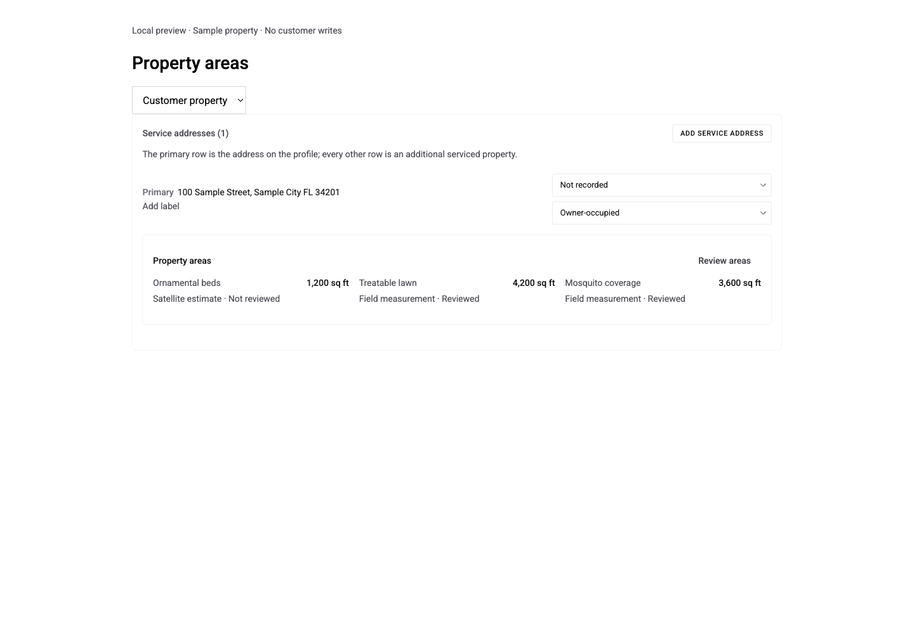
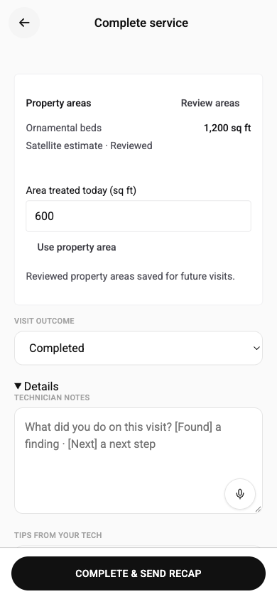
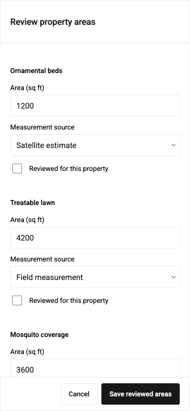

# Shared property areas

Staff can review ornamental-bed, treatable-lawn and mosquito-coverage areas from a saved property or an assigned job, without creating an estimate. The existing address lookup supplies bed/lawn estimates. Only explicitly reviewed areas are saved, with the original measurement method, reviewer and time. Mosquito coverage is entered for the actual service scope; no lot-category or lawn-plus-beds proxy is promoted to an application measurement.

`GATE_PROPERTY_SERVICE_AREAS=true` enables the new endpoints and surfaces. It is off by default in every environment. Run migrations `20260927010000_property_service_areas` and `20260930120000_property_lookup_refresh_claim` (or `migrate:latest`) before enabling it; without the second, every "Get area estimate" is served from the lookup cache only. No production gate or data was changed for this work.

Reviewed measurements belong to `customer_properties`, with primary bed/turf mirrors maintained for existing readers. A partial visit has its own coverage, saved with the draft and frozen in `service_records.structured_notes.propertyServiceArea` on ordinary completion. The internal T&S `bed_sqft_serviced` field follows this coverage for the existing estimate-actuals flow. Opening a job records no application.

Version checks reject concurrent area/address edits, including changes to a legacy turf value that has not yet been reviewed. Reviewed lawn saves update property and matching-primary customer `property_sqft` together with the turf profile. Primary-property changes replace or clear the former lawn mirror even while the feature gate is off. Assigned-visit writes recheck the live technician assignment under the existing customer/visit locks. Lookup refreshes preserve reviewed areas. A forced live refresh is limited to one per address every two minutes across all servers (`property_lookups.live_refresh_claimed_at`); a repeat inside that window is served from the lookup cache. Secondary properties cannot read or overwrite primary turf/bed mirrors. A manual legacy turf-profile area correction withdraws the prior lawn review and moves the primary property and customer `property_sqft` mirrors to the new amount.

Draft visit coverage carries its service-area kind, so bed coverage cannot become mosquito coverage after reclassification. Products awaiting an area response are discarded when the visit changes. Area corrections invalidate untouched generated report text while retaining technician-edited prose.

Eligible selected products reuse the existing rate calculator. Granular bed quantities follow coverage; per-gallon products still need finished mix gallons. Manual amounts and individual product areas stay entered. Palm canopy dosing and bed-only products on lawn visits do not inherit the whole service area. This change does not select a new treatment program or automatically add T&S protocol products.

## Verification

- Real PostgreSQL tests create only synthetic rows in an owned schema in this worktree's private QA database. They exercise the migration up/down, stale and concurrent saves, property and assignment scope, estimate provenance, partial-visit snapshots, and transactional audit rollback. No production database access or live customer lookup.
- React tests exercise area review, selective saves, zero/missing values, stale saves, late-response isolation, T&S granular amounts, palm exclusions, per-gallon mosquito use, lawn defaults, and preserved manual quantities.
- The real `CustomerPropertiesPanelV2`, `PropertyServiceAreas`, and `CompletionPanel` were rendered with an in-memory API fixture at 1440px and 390px. No horizontal overflow. Review dialogs scroll above their fixed save controls. The sample Snapshot row calculated 2.76 lb for 1,200 sq ft and 1.38 lb for 600 sq ft; changing coverage preserved a manually entered 2 lb.
- Local production build, portal-brand check and domain checks passed. Full application/CI results are reported in the PR; the local UI fixture does not exercise a live closeout or customer communications.
- Review follow-up passed 234 server checks (including the public-route scanner and shared turf-write fence), 19 component/completion checks, and 15 isolated PostgreSQL cases. The four new UI request sites are recorded as reviewed but unsupported/unverified for Intelligence Bar parity. Hosted checks are rerun on the updated commit.

## Screenshots

